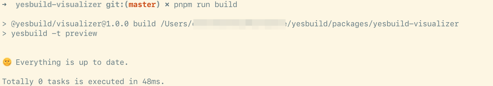
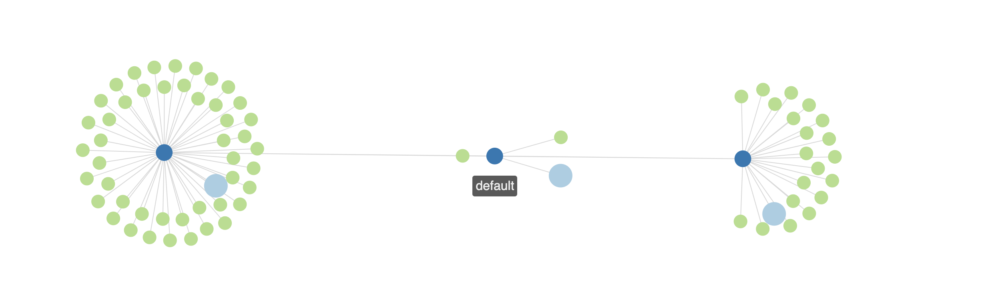

# Yesbuild

A scable and extensible build system for the Web ecosystem.

## Features

- Automatically dependencies tracing
- Fast and incremental build *WITHOUT* resident process
- Parallel
- Simple syntaxes to config
- Easy to compose
- Easy to know what happended
- Full typed plugin API
- Easy to integrate with other bundlers

## Why

Currently, most of the bundlers hide the details internally.
When the project become large, the dependencies become complex.
There is no way to understand how to optimize the procedures.

Besides, it's hard for a bundler to build incrementally.
Mosts of the tools load everything into the memory to implement hot reload, 
that's a disaster for a very large project.
It will cost Gb level memory and there
is no way to debug.

Yesbuild is a friendly tool for you to make your own building procedures.
It divides the building procedure into multiple tasks.
Tasks can be composed, and can be excuted standalone.
And they are persistent.

It makes your building procedure more reasonable, more easy to
compose things.

## Install

### Globally

```sh
npm install -g yesbuild
```

### Scoped

```sh
yarn install yesbuild
```

or

```sh
pnpm i yesbuild
```

## Usage

### Quick Start

Make a new file named `yesbuild.config.js` in your project directory.

Define a task:

```typescript
import yesbuild, { useEsBuild } from 'yesbuild';

yesbuild.defineTask('preview', () => useEsBuild({
    entryPoints: ['./src/index.tsx'],
    bundle: true,
    format: 'esm',
    platform: 'browser',
    sourcemap: true,
    splitting: true,
}));
```

Type `yesbuild` in shell to run:

```sh
yesbuild
```

And the procedure begins...

When you type `yesbuild` again, the magic happens:



Nothing changes because the Yesbuild knows that your source files
don't changed. If you modified your source files, Yesbuild
will execute the action next time you build.

### Simple example to start a dev server

This example demonstrates how to compose tasks.

You can use the result of a task as the input to another task.

> You can run this example in `packages/yesbuild-visualizer/`

```typescript
import yesbuild, { uesEsBuild, useCopy, useTask, useTaskDir, useDevServer } from 'yesbuild';

// define a task for the preview assets
yesbuild.defineTask('preview', () => uesEsBuild({
    entryPoints: ['./src/index.tsx'],
    bundle: true,
    format: 'esm',
    platform: 'browser',
    sourcemap: true,
    splitting: true,
}));

// copy static assets to the task directory,
yesbuild.defineTask('assets', function*() {
  const taskDir = useTaskDir();
  yield useCopy('./assets/*', taskDir, {
    relative: './assets/'
  });
});

// use the result of the preview task to start a dev server
yesbuild.defineTask('serve', function* () {
  // get the result of other tasks
  const assets = yield useTask('assets');
  const preview = yield useTask('preview');
  return useDevServer({
    port: 3000,
    mapResults: [assets, result],  // dev server will map the requests to other tasks
  });
});
```

Type `yesbuild -t serve` to start the server.

Remember, all the dependencies are saved in the files in your `build` directory.
So if they don't changed, nothing will be built next time.

Check `build/yesbuild.preview.yml` and you will know what `yesbuild` has done for you.

## Internal actions

| name | description |
|------|------------|
| useEsBuild | [esbuild](https://github.com/evanw/esbuild/) |
| useCopy | Copy files |
| useParallel | Run tasks in parallel |
| useDevServer | Run a dev server and map files from other tasks |

## External actions

| name | package name | Location |
|------|--------------|----------|
| useTypescript | `@yesbuild/typescript` | [packages/yesbuild-typescript](./packages/yesbuild-typescript) |

More and more actions will be added...

## Write your own action

Check [contributing guide](./docs/CONTRIBUTING.md).

## Visualization

Running the project in `packages/yesbuild-visualizer/`
which is built yesbuild. Drag your files in the build folder
into it and you can view the dependencies in the browser.


