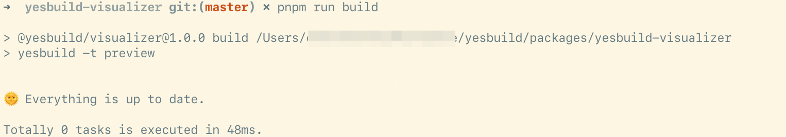
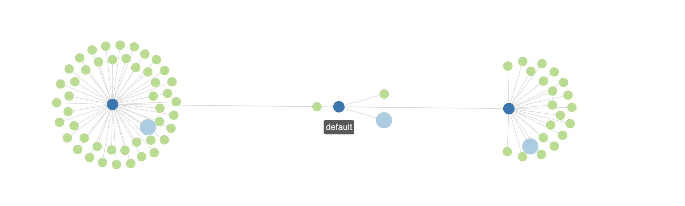

[](https://www.npmjs.com/package/yesbuild-core)

# Yesbuild

一个可扩展的增量构建系统。

## 特性

- 自动追踪构建依赖
- 快速增量构建，无需常驻进程
- 支持并行构建
- 简单的配置语法
- 易于组合
- 易于理解的执行过程
- 所有 API 支持 TypeScript
- 容易和其他工具进行集成

## Why

当前大部分的打包工具内部构建过程不透明。
当项目很大的时候，依赖变得非常复杂，基本很难进行优化。

当前的构建工具基本不支持增量构建，除了使用一大堆 `cache-loader`。
但是这并不可控。而结果就是打包过程中很容易占用极高内存，导致无法调试内存泄漏，也不清楚内部做了什么。

Yesbuild 是一个简单的工具，让你很容易去构建你自己的增量构建流程。
它把你的流程拆分成很多 tasks。这些 tasks 可以组合，可以并行，而且天然就是持久化和增量的。

## 安装

### 全局

```sh
npm install -g yesbuild-core
```

### 局部

```sh
yarn install yesbuild-core
```

or

```sh
pnpm i yesbuild-core
```

## 使用方法

### Quick Start

在你的项目目录创建一个名字叫 `yesbuild.config.js` 的文件。

定义一个任务：

```typescript
import yesbuild, { useEsBuild } from 'yesbuild-core';

yesbuild.defineTask('preview', () => useEsBuild({
    entryPoints: ['./src/index.tsx'],
    bundle: true,
    format: 'esm',
    platform: 'browser',
    sourcemap: true,
    splitting: true,
}));
```

在命令行里面打一个 `yesbuild`：

```sh
yesbuild
```

然后就开始构建了。。。

当你再打一次 `yesbuild`，你会发现：



什么都没有发生。因为 Yesbuild 知道你的源文件没变。如果你修改一下你的源文件，
然后再执行一次， Yesbuild 就会进行构建。

### 简单的 Dev server

这个例子说明如何组合不同的 tasks。

你可以用一个 task 的输出作为其他 task 的输入：

> 你可以直接运行这个目录下面的例子： `packages/yesbuild-visualizer/`

```typescript
import yesbuild, { uesEsBuild, useCopy, useTask, useTaskDir, useDevServer } from 'yesbuild-core';

// 定义一个任务用来构建 js 资源
yesbuild.defineTask('preview', () => uesEsBuild({
    entryPoints: ['./src/index.tsx'],
    bundle: true,
    format: 'esm',
    platform: 'browser',
    sourcemap: true,
    splitting: true,
}));

// 复制一些静态资源
yesbuild.defineTask('assets', function*() {
  const taskDir = useTaskDir();
  yield useCopy('./assets/*', taskDir, {
    relative: './assets/'
  });
});

// 关键！
// 使用其他两个 tasks 的结果，来启动一个 dev server
yesbuild.defineTask('serve', function* () {
  // 拿到其他两个 tasks 的结果
  const assets = yield useTask('assets');
  const preview = yield useTask('preview');
  return useDevServer({
    port: 3000
    mapResults: [assets, result],  // dev server 会自动映射 url 到其他 tasks
  });
});
```

在命令行输入 `yesbuild -t serve` 来启动服务器。

要记住，所有的依赖都被保存在你项目的 `build` 文件夹。如果你的源文件没有变，
Yesbuild 是不会重新进行构建的。

如果你查看 `build/yesbuild.preview.yml` 这个文件你就知道 `yesbuild` 到底干了什么。

## 内部 actions

| Name | Description |
|------|------------|
| useEsBuild | [esbuild](https://github.com/evanw/esbuild/) |
| useCopy | Copy files |
| useParallel | Run tasks in parallel |
| useDevServer | Run a dev server and map files from other tasks |

## 外部 actions

| Name | Package name | Location |
|------|--------------|----------|
| useTypescript | `yesbuild-typescript` | [packages/yesbuild-typescript](./packages/yesbuild-typescript) |

## 写一个你自己的 Action

可以看看 [contributing guide](./docs/CONTRIBUTING.md).

## 可视化

运行这个目录下的项目： `packages/yesbuild-visualizer/`

这个项目本身使用 Yesbuild 构建的，你可以用它来学习如何配置一个最简单的项目。 只要你把 yml 文件拖进去，你就能看到关系图了。


